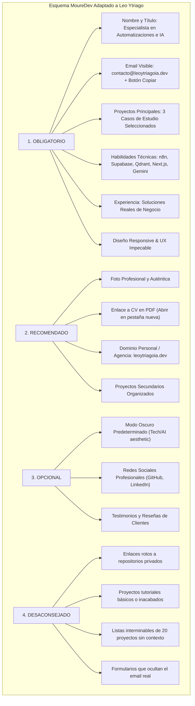
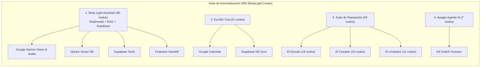

# 📋 PLAN MAESTRO: PORTAFOLIO PROFESIONAL & ESTRATEGIA TÉCNICA
**Autor:** Leonardo Ytriago | **Agencia:** Sapiens IA (`leoytriagoia.dev`)  
**Fecha:** Octubre 2026 | **Versión:** 1.0 (Producción)

---

## 🎯 1. OBJETIVO DEL DOCUMENTO
Este documento consolida la arquitectura estratégica, técnica y de seguridad para la construcción del portafolio personal de **Leonardo Ytriago** integrado en el ecosistema de **Sapiens IA**.

Recopila la auditoría completa de los proyectos existentes, la evaluación de riesgos de ciberseguridad sobre la visibilidad de repositorios en GitHub, el análisis del esquema de MoureDev, el inventario de workflows de n8n, el uso avanzado de Supabase y Qdrant, y la hoja de ruta para su implementación directa en el proyecto `Web Sapiens-ia`.

---

## 🛑 2. POLÍTICA DE SEGURIDAD Y VISIBILIDAD DE REPOSITORIOS (REGLA ANTI-COMPLACENCIA)

### 2.1 El Peligro de Alternar Repositorios a Públicos "Temporalmente"
> **Decisión Técnica:** **PROHIBIDO terminantemente hacer públicos los repositorios de clientes o proyectos con datos sensibles**, incluso por períodos breves de tiempo.

#### Argumentación Técnica y Fuentes Comprobables:
1. **Detección Automatizada en Segundos:**
   - De acuerdo con las investigaciones de [GitGuardian (*State of Secrets Sprawl*)](https://blog.gitguardian.com/how-long-does-it-take-an-attacker-to-find-leaked-secrets-on-github/), los actores maliciosos monitorean la API pública en tiempo real de eventos de GitHub (`/events`).
   - El tiempo medio de detección (*Mean Time to Detect - MTTD*) de un secreto filtrado en un repositorio público es de **4 segundos**.
   - Los ataques y explotación de claves (OpenAI, AWS, Meta, Supabase Service Role) ocurren en minutos.

2. **Persistencia Inmutable en la Infraestructura de GitHub (CFOR):**
   - Investigaciones de [Truffle Security (Julio 2024)](https://trufflesecurity.com/blog/anyone-can-access-deleted-and-private-repo-data-on-github) documentaron la vulnerabilidad inherente de diseño denominada **Cross-Fork Object Reference (CFOR)**.
   - Si un repositorio se hace público, cualquier fork creado por bots o usuarios almacena los hashes de los commits permanentemente.
   - Aunque el repositorio vuelva a ser configurado como privado o se borre, los objetos y commits históricos permanecen accesibles en los servidores de GitHub a través de la red del repositorio.

3. **Archivos Públicos Permanentes:**
   - Proyectos como [GH Archive](https://www.gharchive.org/) y [Software Heritage](https://www.softwareheritage.org/) sincronizan y archivan de forma inmutable cada commit que toca el espacio público.

4. **Vulnerabilidades Locales Detectadas en la Auditoría:**
   - En la auditoría local de tus repositorios se detectaron **GitHub Personal Access Tokens (PAT)** en texto plano configurados en los remotes de `.git/config`:
     - `D:\SAPIENS-IA\CRM-Bodylight-V2`: Remote con token PAT activo.
     - `D:\AGENCIA SAPIENS-IA\Clinica Estetica BLC`: Remote con token PAT activo.
   - Cualquier cambio de visibilidad expondría credenciales críticas de tus clientes y de tu cuenta personal.

5. **Confidencialidad Médica y Contractual (BodyLight Center):**
   - `Clinica Estetica BLC` gestiona esquemas de salud estética, historial de tratamientos, teléfonos reales de pacientes y citas.
   - Publicar el código fuente vulnera acuerdos de confidencialidad (NDA), normativas de datos y la confianza comercial del cliente.

6. **Experiencia del Usuario y Reclutador (Error 404):**
   - Si se enlaza a un repositorio privado desde el portafolio, el visitante recibirá un error **404 Not Found**, transmitiendo una imagen de descuido o funcionalidad rota.

---

## 📺 3. ESTRUCTURA DEL PORTAFOLIO SEGÚN EL MODELO MOUREDEV
Basado en el desglose del video de Brais Moure (*¿Cómo crear el PORTAFOLIO PERFECTO para PROGRAMADORES?* — `zFbTXe1yFGA`) y su esquema oficial ([`mouredev.com/images/portafolio.jpg`](https://mouredev.com/images/portafolio.jpg)):

### 💡 Tratamiento de Proyectos Confidenciales (Estudios de Caso / Case Studies)
Como enseña MoureDev, los proyectos corporativos y de clientes no requieren exponer código crudo:
- Se presentan como **Casos de Estudio**:
  1. **Problema de Negocio:** ¿Qué dolencia u obstáculo operativo tenía el cliente?
  2. **Arquitectura y Solución:** ¿Cómo se diseñó el flujo (n8n, Supabase, Qdrant, Chatwoot)?
  3. **Rol Técnico:** Responsabilidad exacta (Arquitecto de Automatización, Backend, Fullstack).
  4. **Impacto y Métricas:** Tiempo ahorrado, aumento de citas, respuesta 24/7.
  5. **Demostración:** Capturas de interfaz, diagramas de flujo y videos screencast.

---

## 🔍 4. AUDITORÍA DEL PERFIL DE GITHUB (`DefiPlus1`)

- **Estado Actual:**
  - Bio: *"Consultor en Inteligencia artificial y experto en Automatizaciones con IA. Transformo: facturación y rentabilidad"*.
  - Repositorios públicos visibles: 4 (`web-Sapiens-ia`, `CRM-Plantilla-Original`, `Calculadora-para-costo-de-consultoria`, `Prueba-Tecnica-inlaze-LeoYtriago`).
  - **Falta el README de Perfil:** El repositorio `DefiPlus1/DefiPlus1` no existe actualmente.
- **Acción a Ejecutar:**
  1. Crear repositorio especial `DefiPlus1/DefiPlus1` con `README.md` estilizado con métricas, tecnologías y propuesta de valor.
  2. Crear 1 único repositorio público saneado de demostración técnica (Showcase): `n8n-gemini-multimodal-agent` con plantillas limpias, sin credenciales, y documentación técnica de nivel enterprise.

---

## 📂 5. AUDITORÍA DE PROYECTOS LOCALES

| Proyecto | Ruta Local | Estado y Autoría | Rol en el Portafolio |
| :--- | :--- | :--- | :--- |
| **`Clinica Estetica BLC`** | `D:\AGENCIA SAPIENS-IA\Clinica Estetica BLC` | **Desarrollo 100% propio de Leo.** CRM médico + Chatwoot + n8n + Supabase RLS. | **PROYECTO ESTRELLA #1 (Caso de Estudio).** Ecosistema operativo completo. |
| **`BLC-Landing`** | `D:\AGENCIA SAPIENS-IA\BLC-Landing` | **Desarrollo 100% propio.** Landing oficial en producción (`landing.bodylightcenter.com`). | **PROYECTO WEB #2 (Demo en Vivo).** Widget de IA Sofía interactivo, Next.js, Dokploy. |
| **`Web Sapiens-ia`** | `D:\SAPIENS-IA\Web Sapiens-ia` | **Desarrollo 100% propio.** Web corporativa (`leoytriagoia.dev`), Meta Tech Provider. | **PROYECTO WEB #3 (Plataforma Base).** Sitio de la agencia donde se integrará este portafolio. |
| **`CRM-Bodylight-V2`** | `D:\SAPIENS-IA\CRM-Bodylight-V2` | **Base Open-Source:** `DeskcommCRM` (Rafael Melgaço, MIT). **Aporte propio:** Módulo clínica estética (~2.650 líneas). | **Extensión de CRM.** Explicar con honestidad intelectual como módulo médico sobre base open-source. |
| **`CRM SAPIENS-IA`** | `D:\SAPIENS-IA\CRM SAPIENS-IA` | Clon idéntico de Deskcomm con traducción y ajuste de colores. | No mostrar por separado (redundante). |

---

## ⚡ 6. RANKING Y ANÁLISIS DE WORKFLOWS DE N8N

Se auditaron los workflows ubicados en `Clinica Estetica BLC/specs/` y descargas del sistema:

### Tabla de Evaluación:
1. **`Body Ligth Assistant final (9).json` (65 nodos) — [Puntuación: 10/10 ⭐ Enterprise]**
   - *Capacidades:* Visión computacional (Gemini analiza fotos de piel y procedimientos), transcripción de audios de WhatsApp, Tool Calling sobre Supabase (`buscar_paciente`, `crear_paciente`, `actualizar_paciente`, `buscar_especialista`, `Crear lista de espera`), RAG con Qdrant (`vectorStoreQdrant`), memoria persistente en PostgreSQL (`memoryPostgresChat`) y control de presencia en Chatwoot.
2. **`Reputación - El Escudo` (18 nodos) — [Puntuación: 9.5/10 Negocio Real]**
   - *Capacidades:* Intercepta inconformidades de pacientes antes de que impacten públicamente en Google Reviews y activa alertas automáticas a gerencia.
3. **`Escribir Cita (Supabase + Google Calendar)` (21 nodos) — [Puntuación: 9.0/10]**
   - *Capacidades:* Coordinación bidireccional de agendas, bloqueo de colisiones de horarios y persistencia transaccional.
4. **`Reputación - El Cazador` / `El Limpiador` (10 y 11 nodos) — [Puntuación: 8.5/10]**
   - *Capacidades:* Solicitud automatizada de reseñas 5 estrellas a pacientes satisfechos y mantenimiento de colas de feedback.
5. **`Apagar Agente IA` (7 nodos) — [Puntuación: 8.5/10]**
   - *Capacidades:* Handoff y conmutación transparente cuando un agente humano interviene en Chatwoot.

---

## 🧠 7. CÓMO DEMOSTRAR EL DOMINIO DE SUPABASE Y QDRANT

### A. Para Supabase (PostgreSQL Avanzado):
1. **Seguridad RLS y Multi-Role RBAC:**
   - Explicar las políticas implementadas en la migración `20260829000000_security_rls_and_roles.sql`: roles `admin`, `staff`, `doctor`, funciones `SECURITY DEFINER` y protección estricta de datos clínicos.
2. **Arquitectura Relacional Médica:**
   - 8 tablas interconectadas: `pacientes`, `citas`, `especialistas`, `tratamientos_paciente`, `lista_espera`, `reputacion_feedback`, `historial_conversaciones`.
3. **Memoria de Agente Persistente:**
   - Integración nativa de `memoryPostgresChat` para persistencia contextual multi-turn.

### B. Para Qdrant (Base de Datos Vectorial RAG):
1. **Desacoplamiento de Carga Operativa:**
   - Explicar por qué utilizar un motor vectorial dedicado en Rust (Qdrant) para búsqueda de vecinos más cercanos (HNSW) en lugar de recargar la base relacional transaccional.
2. **Búsqueda Semántica con Filtrado de Metadatos (Payload Filtering):**
   - Indexación de la base de conocimiento (`01_faq_politicas_blc.md`, `02_catalogo_tratamientos_precios_blc.md`, `03_especialistas_criterios_medicos_blc.md`) con embeddings de Google Gemini y recuperación contextual filtrada.

---

## 🏗️ 8. DECISIÓN DE ARQUITECTURA: INTEGRACIÓN EN `Web Sapiens-ia`

### ¿Por qué integrar el portafolio en `Web Sapiens-ia`?
1. **Alineación con la marca y dominio:** Tu dominio institucional `leoytriagoia.dev` ya está configurado en Cloudflare y apuntando a Dokploy.
2. **Infraestructura lista:** La aplicación Next.js 16 ya cuenta con Tailwind CSS, Framer Motion, sistema de tokens (#080f1e, #10b981), componentes globales (`Header`, `Footer`, `AnimatedSection`) y build validado.
3. **Estrategia de Rutas:**
   - Puede implementarse como una página dedicada dentro del sitio: `leoytriagoia.dev/portafolio` (o una subsección de alto impacto en `/agencia` / home).
   - Mantiene un único despliegue centralizado en Dokploy sin costos de mantenimiento redundantes.

---

## 🚀 9. HOJA DE RUTA DE EJECUCIÓN (ROADMAP)

### Fase 1: Perfil de GitHub Profesional
- [ ] Crear repositorio `DefiPlus1/DefiPlus1` con `README.md` de presentación profesional.
- [ ] Crear repositorio showcase público `n8n-gemini-multimodal-agent` con plantillas limpias y diagrama interactivo.
- [ ] Fijar (Pin) los repositorios estratégicos.

### Fase 2: Implementación en `Web Sapiens-ia`
- [ ] Abrir conversación de desarrollo en `D:\SAPIENS-IA\Web Sapiens-ia`.
- [ ] Crear la ruta `/portafolio` (o componente dedicado) en `Sapiens-ia_FinishedWeb/sapiens-web/src/app/portafolio/page.tsx`.
- [ ] Diseñar las 3 tarjetas de Casos de Estudio con estética bioluminiscente (BodyLight Center, Suite de Reputación, Ecosistema Sapiens IA).
- [ ] Integrar botón de descarga/visualización del CV en PDF.
- [ ] Incorporar botón interactivo de "Copiar Correo" (`contacto@leoytriagoia.dev`).
- [ ] Documentar visualmente los flujos de n8n, Supabase RLS y Qdrant Vector Search.

### Fase 3: Pruebas y Despliegue
- [ ] Ejecutar `npm run build` en `Web Sapiens-ia` verificando 0 errores de TypeScript y linting.
- [ ] Sincronizar vía Git hacia `origin main` y publicar a producción en Dokploy.
