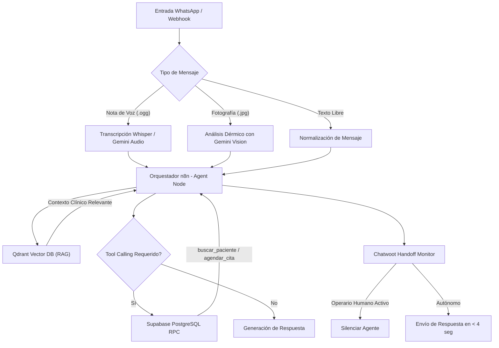

# 🤖 n8n-gemini-multimodal-agent (Enterprise Showcase)

**Autor:** Leonardo Ytriago | **Agencia:** Sapiens IA (`leoytriagoia.dev`)  
**Licencia:** MIT (Plantilla Saneada de Demostración)  
**Versión:** 1.0.0 (Producción)

---

## 📋 Descripción del Proyecto
Este repositorio contiene la **plantilla de arquitectura saneada** del agente de inteligencia artificial multimodal desarrollado por **Leonardo Ytriago** para entornos empresariales y clínicos de alta exigencia.

Demuestra la integración coordinada de:
1. **Google Gemini Vision & Audio:** Comprensión contextual de imágenes, notas de voz de WhatsApp y texto libre.
2. **Qdrant Vector Database:** Recuperación semántica de documentos normativos (RAG) desacoplada en Rust de baja latencia.
3. **Supabase / PostgreSQL:** Persistencia relacional protegida mediante políticas de Row Level Security (RLS) y Tool Calling estructurado.
4. **Chatwoot Integration:** Handoff automático y detección de presencia humana (Kill Switch).

---

## 🏗️ Diagrama de Arquitectura



---

## 🔒 Parámetros de Configuración (`.env.example`)

Para desplegar este workflow en tu instancia de n8n, crea tu archivo `.env` o configura las credenciales correspondientes dentro de n8n:

```env
# Google Gemini API
GEMINI_API_KEY="AIzaSyYourCleanApiKeyHere"
GEMINI_MODEL="gemini-1.5-flash"

# Qdrant Vector Store
QDRANT_URL="https://your-qdrant-instance.yourdomain.com"
QDRANT_API_KEY="your-qdrant-api-key"
QDRANT_COLLECTION="knowledge_base_protocols"

# Supabase PostgreSQL
SUPABASE_URL="https://your-project.supabase.co"
SUPABASE_SERVICE_ROLE_KEY="eyJhbGciOi..."
SUPABASE_DB_HOST="db.your-project.supabase.co"
SUPABASE_DB_NAME="postgres"
SUPABASE_DB_PORT="5432"

# Chatwoot & Webhooks
CHATWOOT_BASE_URL="https://chatwoot.yourdomain.com"
CHATWOOT_API_ACCESS_TOKEN="your-chatwoot-token"
CHATWOOT_ACCOUNT_ID="1"
```

---

## 🚀 Instrucciones de Despliegue en n8n Self-Hosted

1. Clona este repositorio o descarga el archivo `workflows/n8n_gemini_multimodal_agent_template.json`.
2. Abre tu panel de control de n8n (versión $\ge 1.30.0$).
3. Ve a **Workflows** $\rightarrow$ **Import from File**.
4. Vincula las credenciales pre-configuradas para:
   - Google Gemini Chat Model
   - Qdrant Vector Store
   - PostgreSQL / Supabase
   - Chatwoot App
5. Activa el webhook y prueba con una nota de voz o imagen simulada.

---

## 👤 Autor & Contacto
- **Leonardo Ytriago**
- **Portafolio:** [leoytriagoia.dev/portafolio](https://leoytriagoia.dev/portafolio)
- **Email:** [contacto@leoytriagoia.dev](mailto:contacto@leoytriagoia.dev)
- **WhatsApp:** [+58 412 4819608](https://wa.me/584124819608)
