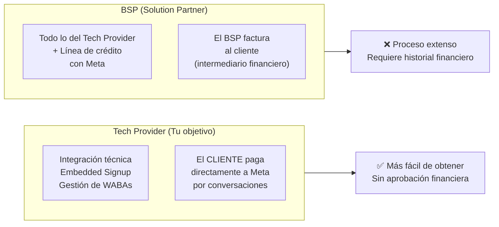
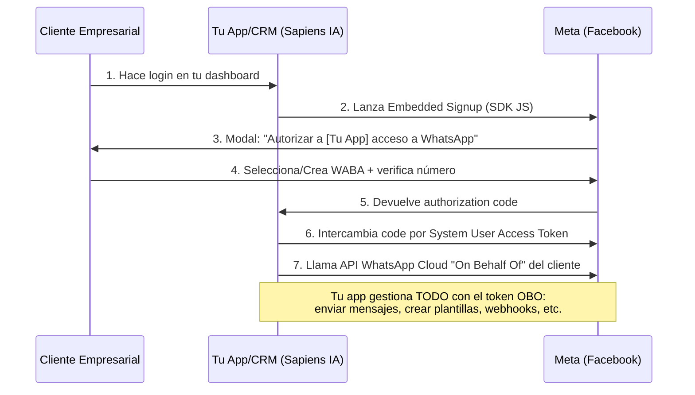
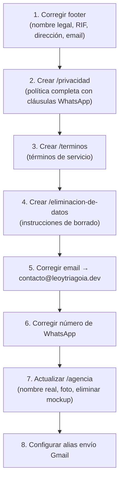
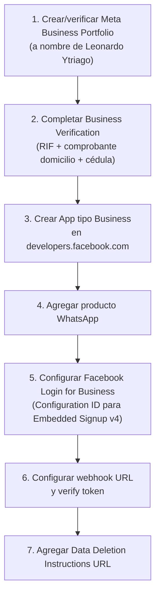

# 🎯 Plan Maestro: Meta Technology Provider — Leonardo Ytriago / Sapiens IA

> **Fecha:** Septiembre 2026  
> **Solicitante:** Leonardo Ytriago (Sapiens IA)  
> **Objetivo:** Registrarse como Meta Technology Provider (persona natural) para ofrecer WhatsApp Cloud API a clientes empresariales mediante Embedded Signup v4.

---

## Tabla de Contenidos

1. [Requisitos y Arquitectura — Tech Provider](#1-requisitos-y-arquitectura--tech-provider)
2. [Implementación de WhatsApp Embedded Signup v4](#2-implementación-de-whatsapp-embedded-signup-v4)
3. [Guía Definitiva del Screencast para App Review](#3-guía-definitiva-del-screencast-para-app-review)
4. [Checklist de Errores Comunes de Rechazo](#4-checklist-de-errores-comunes-de-rechazo)
5. [Análisis y Recomendaciones Personalizadas (Tu Caso)](#5-análisis-y-recomendaciones-personalizadas-tu-caso)
6. [Plan de Acción con Pasos Concretos](#6-plan-de-acción-con-pasos-concretos)

---

## 1. Requisitos y Arquitectura — Tech Provider

### 1.1 ¿Qué es un Tech Provider vs un BSP?



| Característica | Tech Provider | BSP (Solution Partner) |
|---|---|---|
| **Gestión técnica de WABAs** | ✅ Sí | ✅ Sí |
| **Embedded Signup (onboarding clientes)** | ✅ Sí | ✅ Sí |
| **Línea de crédito con Meta** | ❌ No | ✅ Sí |
| **Facturación a clientes** | El cliente paga a Meta directamente | El BSP puede facturar |
| **Proceso de aprobación** | App Review + Business Verification | Todo lo anterior + aprobación financiera |
| **Ideal para** | Agencias/ISVs que construyen plataformas | Empresas grandes con capacidad de billing |

> [!IMPORTANT]
> **Para tu caso, Tech Provider es la ruta correcta.** No necesitas gestionar la facturación de Meta — tus clientes pagarán sus conversaciones directamente. Tú cobras por tu plataforma/CRM y la integración.

### 1.2 Flujo "On Behalf Of" (OBO)



### 1.3 Requisitos Completos para Registrarse

#### A) Crear App en Meta for Developers

1. Ir a [developers.facebook.com/apps](https://developers.facebook.com/apps)
2. Crear app tipo **"Business"**
3. Agregar el producto **"WhatsApp"** a la app
4. Vincular la app a tu **Business Portfolio** (antes llamado Business Manager)

#### B) Business Verification (Verificación de Negocio)

> [!IMPORTANT]
> **SÍ se puede verificar como persona natural/Sole Proprietor.**
> En el formulario de verificación, Meta presenta la opción de seleccionar "Sole Proprietor" / "Individual" como tipo de entidad. Esto está confirmado tanto en la documentación oficial como por desarrolladores en tu comunidad.

**Documentos requeridos para Venezuela (persona natural):**

| Documento | Formato Exacto | Notas Críticas |
|---|---|---|
| **RIF Personal** | PDF descargado del portal SENIAT (con QR vectorizado) | ❌ NO escaneos, NO capturas de pantalla |
| **Comprobante de domicilio** | Factura de servicio público (CANTV/Corpoelec) o estado de cuenta bancario | A TU nombre, dirección idéntica al RIF, <3 meses de antigüedad |
| **Cédula de Identidad** | Escaneo plano a color, 300 DPI, 4 esquinas visibles | Sin reflejos, sin recortes |

> [!CAUTION]
> **REGLA DE ORO:** El nombre, dirección y teléfono deben coincidir **carácter por carácter** entre:
> - Los documentos que subas
> - La información en tu Meta Business Portfolio
> - El footer de tu sitio web (`leoytriagoia.dev`)
>
> Meta usa OCR automatizado. "Av." vs "Avenida", o un código postal faltante, = rechazo automático.

#### C) Permisos Requeridos (Advanced Access)

Para operar como Tech Provider necesitas **Advanced Access** en:

| Permiso | Para Qué Sirve |
|---|---|
| `whatsapp_business_management` | Gestionar WABAs de clientes: crear plantillas, administrar números, Embedded Signup |
| `whatsapp_business_messaging` | Enviar/recibir mensajes en nombre del cliente |

Ambos requieren **App Review con screencast individual** para cada uno.

#### D) Directivas de Datos Obligatorias

1. **Política de Privacidad** — URL HTTPS pública, sin login, con cláusulas específicas de WhatsApp
2. **Términos de Servicio** — URL HTTPS pública
3. **Data Deletion** — Endpoint callback o página de instrucciones de eliminación de datos
4. **Data Use Checkup** — Meta enviará auditorías periódicas que debes completar

---

## 2. Implementación de WhatsApp Embedded Signup v4

### 2.1 Cronología y Deprecación

| Versión | Estado | Fecha Límite |
|---|---|---|
| Embedded Signup v2 | ⚠️ **DEPRECADO** | 15 octubre 2026 |
| Embedded Signup v3 | ⚠️ **DEPRECADO** | 15 octubre 2026 |
| **Embedded Signup v4** | ✅ **VIGENTE (obligatorio)** | Implementar ya |

> [!WARNING]
> **Quedan ~3 semanas (al 25/sept/2026) para que v2 y v3 dejen de funcionar.** Si estás empezando desde cero, implementa directamente v4. No pierdas tiempo con versiones anteriores.

### 2.2 Cambios Clave en v4

1. **"Phone Number First"** — El usuario ingresa su número de teléfono comercial al inicio del flujo, no al final. Esto detecta problemas de elegibilidad tempranamente.
2. **Configuración en el Dashboard** — Ya NO se usa el objeto `extras` en el código JavaScript. Las opciones se configuran en: `Meta App Dashboard > Facebook Login for Business > Configurations`.
3. **Unificación** — v4 es un flujo unificado para WhatsApp, Messenger e Instagram.

### 2.3 Implementación Técnica

#### Paso 1: Configurar en Meta App Dashboard

```
Meta App Dashboard
  └── Facebook Login for Business
       └── Configurations
            └── Crear nueva configuración
                 ├── Seleccionar productos: ✅ WhatsApp
                 ├── Configuration ID → (guardar este ID)
                 └── Redirect URI → https://leoytriagoia.dev/api/meta/callback
```

#### Paso 2: Frontend — Integrar el SDK de JavaScript

```html
<!-- En tu página de onboarding del CRM -->
<script async defer crossorigin="anonymous" 
  src="https://connect.facebook.net/en_US/sdk.js">
</script>

<script>
  // Inicializar el SDK
  window.fbAsyncInit = function() {
    FB.init({
      appId: 'TU_APP_ID',          // ID de tu app de Meta
      autoLogAppEvents: true,
      xfbml: true,
      version: 'v20.0'             // Usar la versión más reciente
    });
  };

  // Función para lanzar Embedded Signup
  function launchEmbeddedSignup() {
    FB.login(function(response) {
      if (response.authResponse) {
        const code = response.authResponse.code;
        // Enviar el code a tu backend para intercambiar por token
        fetch('/api/meta/exchange-token', {
          method: 'POST',
          headers: { 'Content-Type': 'application/json' },
          body: JSON.stringify({ code })
        })
        .then(res => res.json())
        .then(data => {
          console.log('WABA vinculada:', data);
          // Redirigir al dashboard del cliente
        });
      }
    }, {
      config_id: 'TU_CONFIGURATION_ID', // El ID de la configuración v4
      response_type: 'code',              // Solicitar authorization code
      override_default_response_type: true,
      extras: {
        sessionInfoVersion: 2             // Requerido para v4
      }
    });
  }
</script>

<!-- Botón de Embedded Signup en tu UI -->
<button onclick="launchEmbeddedSignup()" class="btn-whatsapp-connect">
  Conectar WhatsApp Business
</button>
```

#### Paso 3: Backend — Intercambiar Code por Token

```javascript
// /api/meta/exchange-token (Next.js API Route)
export async function POST(req) {
  const { code } = await req.json();
  
  // Intercambiar authorization code por access token
  const tokenResponse = await fetch(
    `https://graph.facebook.com/v20.0/oauth/access_token` +
    `?client_id=${process.env.META_APP_ID}` +
    `&client_secret=${process.env.META_APP_SECRET}` +
    `&code=${code}`,
    { method: 'GET' }
  );
  
  const { access_token } = await tokenResponse.json();
  
  // Con el token, obtener las WABAs compartidas
  const wabaResponse = await fetch(
    `https://graph.facebook.com/v20.0/debug_token` +
    `?input_token=${access_token}`,
    { 
      headers: { 'Authorization': `Bearer ${process.env.META_SYSTEM_TOKEN}` }
    }
  );
  
  const wabaData = await wabaResponse.json();
  // Guardar token y WABA ID en Supabase
  // Configurar webhook subscription para este WABA
  
  return Response.json({ success: true, waba: wabaData });
}
```

#### Paso 4: Webhooks

```javascript
// /api/meta/webhook (Next.js API Route)
// Verificación del webhook (GET)
export async function GET(req) {
  const { searchParams } = new URL(req.url);
  const mode = searchParams.get('hub.mode');
  const token = searchParams.get('hub.verify_token');
  const challenge = searchParams.get('hub.challenge');
  
  if (mode === 'subscribe' && token === process.env.WEBHOOK_VERIFY_TOKEN) {
    return new Response(challenge, { status: 200 });
  }
  return new Response('Forbidden', { status: 403 });
}

// Recepción de mensajes (POST)
export async function POST(req) {
  const body = await req.json();
  
  // Procesar mensajes entrantes
  for (const entry of body.entry) {
    for (const change of entry.changes) {
      if (change.field === 'messages') {
        const message = change.value.messages?.[0];
        if (message) {
          // Guardar en Supabase, enviar a n8n, etc.
          console.log('Mensaje recibido:', message);
        }
      }
    }
  }
  
  return new Response('OK', { status: 200 });
}
```

---

## 3. Guía Definitiva del Screencast para App Review

> [!CAUTION]
> **El screencast es la causa #1 de rechazo.** Meta rechaza automáticamente si el video no muestra claramente cómo TU app (no la de Meta) usa el permiso solicitado. Sigue este guion al pie de la letra.

### 3.1 Reglas Generales

| Aspecto | Requisito |
|---|---|
| **Formato** | MP4, códec H.264 |
| **Resolución** | 1920x1080 (1080p) mínimo |
| **FPS** | 30 fps |
| **Duración** | 1.5 a 3 minutos por permiso (máximo 4 min) |
| **Videos** | **UN VIDEO SEPARADO POR CADA PERMISO** |
| **Idioma** | Subtítulos hardcoded en inglés (obligatorio) |
| **Audio** | Opcional, pero NO depender solo de audio |
| **Herramientas** | OBS Studio (gratis) o Loom |
| **Técnica recomendada** | Pantalla dividida (split-screen): tu CRM + WhatsApp del cliente |

> [!WARNING]
> **NUNCA:**
> - Grabar a 720p (el texto se vuelve ilegible para el revisor)
> - Mostrar la interfaz de Meta (business.facebook.com) como si fuera tu app
> - Usar cortes abruptos o fast-forward
> - Subir un solo video para ambos permisos
> - Dejar el video detrás de autenticación (Google Drive privado, Vimeo con clave)

### 3.2 Video 1: `whatsapp_business_management`

**Duración objetivo:** 2-3 minutos

#### Guion Paso a Paso

````carousel
**🎬 Escena 1: Login (0:00 - 0:20)**

Subtítulo: `"Step 1: Business admin logs into Sapiens IA CRM dashboard"`

- Mostrar la pantalla de login de tu CRM
- Ingresar con las credenciales de prueba
- El dashboard carga con datos pre-cargados (NO pantalla vacía)

<!-- slide -->
**🎬 Escena 2: Embedded Signup (0:20 - 1:00)**

Subtítulo: `"Step 2: Admin clicks 'Connect WhatsApp' to start Embedded Signup flow"`

- Navegar a la sección de "Configuración" o "Canales"
- Hacer clic en el botón **"Conectar WhatsApp Business"**
- Se abre el modal/popup de Meta
- Subtítulo: `"Facebook Login for Business popup - client authorizes access to their WhatsApp Business Account"`
- Completar el flujo: seleccionar/crear WABA, verificar número

Subtítulo: `"Step 3: After authorization, the client's WABA appears in our dashboard with full management capabilities"`

- Mostrar que el dashboard ahora muestra la WABA conectada

<!-- slide -->
**🎬 Escena 3: Gestión de Plantillas (1:00 - 2:00)**

Subtítulo: `"Step 4: Admin creates a new WhatsApp message template directly from our CRM interface"`

- Ir a la sección "Plantillas" en tu CRM
- Hacer clic en "Crear Plantilla"
- Llenar: nombre, categoría (MARKETING/UTILITY), idioma, cuerpo del mensaje
- Hacer clic en "Enviar a Revisión"
- Subtítulo: `"Template submitted via POST to Graph API /v20.0/{waba_id}/message_templates"`
- Mostrar la plantilla en estado "Pendiente de aprobación"

<!-- slide -->
**🎬 Escena 4: Administración de Números (2:00 - 2:30)**

Subtítulo: `"Step 5: Admin views connected phone numbers and their quality ratings"`

- Mostrar la lista de números telefónicos asociados a la WABA
- Mostrar métricas: calidad del número, estado de verificación

Subtítulo: `"This demonstrates how our app uses whatsapp_business_management to manage WhatsApp assets on behalf of our business clients"`

<!-- slide -->
**🎬 Cierre (2:30 - 2:45)**

Subtítulo: `"Summary: Our CRM provides a complete management interface for WhatsApp Business Accounts, including Embedded Signup onboarding, template creation, and phone number management — all through the WhatsApp Cloud API."`
````

### 3.3 Video 2: `whatsapp_business_messaging`

**Duración objetivo:** 1.5-2.5 minutos

#### Guion Paso a Paso (Técnica Split-Screen)

````carousel
**🎬 Escena 1: Login (0:00 - 0:15)**

Subtítulo: `"Step 1: Business operator logs into Sapiens IA CRM"`

- Login rápido al CRM

<!-- slide -->
**🎬 Escena 2: Enviar Mensaje — Split Screen (0:15 - 1:00)**

**Configuración de pantalla:** 
- **Lado izquierdo:** Tu CRM/dashboard
- **Lado derecho:** WhatsApp Web o emulador de teléfono (Scrcpy/Vysor)

Subtítulo: `"Step 2: Operator sends a template message to a customer via our CRM interface"`

- En el CRM: seleccionar un contacto, elegir una plantilla aprobada
- Hacer clic en **"Enviar Mensaje"**
- Subtítulo: `"Message sent via POST to Graph API /v20.0/{phone_number_id}/messages"`
- **En el lado derecho:** Mostrar la notificación/mensaje llegando EN TIEMPO REAL a WhatsApp

Subtítulo: `"✅ Message delivered instantly — visible on the recipient's WhatsApp"`

<!-- slide -->
**🎬 Escena 3: Recibir Mensaje (1:00 - 1:45)**

Subtítulo: `"Step 3: Customer replies — our webhook receives the incoming message"`

- **Lado derecho:** El "cliente" responde desde WhatsApp
- **Lado izquierdo:** Mostrar cómo el mensaje aparece en el CRM inmediatamente
- Subtítulo: `"Incoming message received via webhook POST to our /api/meta/webhook endpoint"`

<!-- slide -->
**🎬 Escena 4: Conversación Completa (1:45 - 2:15)**

Subtítulo: `"Step 4: Full conversation thread in our CRM — operator can reply in real-time"`

- Mostrar el hilo de conversación completo en tu CRM
- El operador responde desde el CRM → se ve en WhatsApp del lado derecho

Subtítulo: `"This demonstrates how our app uses whatsapp_business_messaging to send and receive messages on behalf of business clients through the WhatsApp Cloud API"`
````

### 3.4 Notas para el Revisor (Reviewer Instructions)

Copiar y pegar esto en el campo "Notes for the Reviewer" de Meta:

```
TESTING INSTRUCTIONS — Sapiens IA CRM (WhatsApp Cloud API Integration)

1. Login URL: https://crm.leoytriagoia.dev/login
   Username: reviewer@leoytriagoia.dev
   Password: [password sin 2FA]

2. IMPORTANT: This account has 2FA DISABLED for testing purposes.

3. The test account is pre-loaded with:
   - 1 connected WhatsApp Business Account (WABA)
   - 3 approved message templates
   - 5 test contacts with message history

4. To test whatsapp_business_management:
   a. Navigate to Settings > WhatsApp > Templates
   b. Click "Create Template" to create a new template
   c. Navigate to Settings > WhatsApp > Phone Numbers to view managed numbers

5. To test whatsapp_business_messaging:
   a. Navigate to Conversations
   b. Select any contact and send a template message
   c. The test phone number +58-XXX-XXXXXXX will receive the message

6. Our app provides a SaaS platform where business clients
   manage their WhatsApp communications without accessing
   Meta's native interface.
```

---

## 4. Checklist de Errores Comunes de Rechazo

### Los 7 Motivos Más Frecuentes de Rechazo (y Cómo Blindarse)

#### ❌ Error #1: El Screencast No Muestra la Acción del Permiso

> *"Your screencast does not show how your app uses the requested permission"*

| Problema | Solución |
|---|---|
| Mostrar slides, Figma, o solo navegar por el dashboard | Ejecutar la acción REAL: enviar mensaje, crear template |
| Mostrar terminal/Postman en lugar de UI | Toda acción debe hacerse desde TU interfaz gráfica |

✅ **Blindaje:** Seguir los guiones de la Sección 3 al pie de la letra.

---

#### ❌ Error #2: Redirigir a la Interfaz Nativa de Meta

| Problema | Solución |
|---|---|
| Abrir business.facebook.com para crear plantillas | Construir la gestión de plantillas DENTRO de tu CRM |
| Usar WhatsApp Manager de Meta | Todo debe estar en tu propia UI |

✅ **Blindaje:** Si no tienes un UI para templates, constrúyelo antes del App Review. Es innegociable.

---

#### ❌ Error #3: Datos del Negocio No Coinciden (NAP Mismatch)

| Problema | Solución |
|---|---|
| "Av." en el RIF vs "Avenida" en Meta | Copiar la dirección EXACTA del RIF carácter por carácter |
| Nombre en web ≠ nombre en documentos | El footer de la web debe mostrar tu nombre legal exacto |

✅ **Blindaje:** Verificar triple: RIF ↔ Meta Business Portfolio ↔ Footer del sitio web.

---

#### ❌ Error #4: Credenciales del Revisor Inaccesibles

| Problema | Solución |
|---|---|
| 2FA activado en la cuenta de prueba | **Desactivar 2FA** para la cuenta del reviewer |
| URL privada o localhost | Desplegar en producción accesible públicamente |
| Pantalla vacía (sin datos de prueba) | Pre-cargar datos: contactos, templates, historial |

✅ **Blindaje:** Probar tú mismo con ventana de incógnito antes de enviar.

---

#### ❌ Error #5: Política de Privacidad Deficiente

| Problema | Solución |
|---|---|
| Enlaces rotos (404) | Crear páginas reales en `/privacidad` y `/terminos` |
| Política genérica sin mención de WhatsApp | Incluir cláusulas específicas de WhatsApp Cloud API |
| Sin mecanismo de eliminación de datos | Configurar Data Deletion Callback o página de instrucciones |
| Página detrás de login | Debe ser 100% pública, accesible sin registro |

✅ **Blindaje:** Crear las páginas que detallo en la Sección 5.

---

#### ❌ Error #6: Correo con Dominio Gratuito

| Problema | Solución |
|---|---|
| Registrarse con `@gmail.com` o `@hotmail.com` | Usar correo corporativo: `leo@leoytriagoia.dev` |

✅ **Blindaje:** Ya tienes Email Routing en Cloudflare. Crear `leo@leoytriagoia.dev` o `contacto@leoytriagoia.dev`.

---

#### ❌ Error #7: Cero Actividad en la API Antes de Solicitar

| Problema | Solución |
|---|---|
| App con 0 llamadas a la API en los últimos 30 días | Realizar 5-10 llamadas de prueba exitosas antes del App Review |

✅ **Blindaje:** Con Standard Access (que ya tendrás sin App Review), enviar mensajes de prueba a tu propio número durante 2-3 semanas antes de solicitar Advanced Access.

---

## 5. Análisis y Recomendaciones Personalizadas (Tu Caso)

### 5.1 Auditoría de Tu Sitio Web Actual

He analizado `sapiens-ia-smart-web.vercel.app` / `leoytriagoia.dev` (ambos sirven el mismo contenido):

#### ✅ Lo que FUNCIONA BIEN:
- **Diseño UI/UX:** Nivel profesional, estética moderna dark mode, animaciones fluidas
- **Contenido técnico:** Stack tecnológico bien presentado, blog con artículos reales
- **Ecosistema visual:** El diagrama del flujo de trabajo (canales → n8n → Gemini → Supabase) es impresionante
- **SSL/HTTPS:** Funcionando correctamente
- **DNS Cloudflare:** Configurado con Email Routing

#### 🚨 PROBLEMAS CRÍTICOS (Causarán Rechazo Inmediato en Meta):

| # | Problema | Gravedad | Impacto |
|---|---|---|---|
| 1 | **Política de Privacidad** → enlace apunta a `href="#"` (no existe) | 🔴 Crítico | Rechazo automático |
| 2 | **Términos de Servicio** → enlace apunta a `href="#"` (no existe) | 🔴 Crítico | Rechazo automático |
| 3 | **Email de contacto** → `contact@sapiens-ia.tech` — el dominio `sapiens-ia.tech` **NO EXISTE en DNS** (NXDOMAIN) | 🔴 Crítico | Rebote de emails, genera desconfianza |
| 4 | **No hay nombre legal** en el footer — solo dice "Sapiens-ia" sin titular | 🔴 Crítico | NAP mismatch con RIF |
| 5 | **No hay dirección física** — dice "Latinoamérica & España" | 🔴 Crítico | NAP mismatch con documentos |
| 6 | **No hay RIF ni identificación fiscal** visible | 🟠 Alto | Meta verifica coherencia web ↔ documentos |
| 7 | **No hay teléfono** en el footer | 🟠 Alto | Dificulta verificación |
| 8 | **Enlace de WhatsApp** → `+584224819607` — el prefijo `0422` no existe en Venezuela | 🟠 Alto | Link de WhatsApp roto |
| 9 | **"Dashboard Privado Mockup · Próximamente"** visible en `/agencia` | 🟡 Medio | Demuestra que el software no está en producción |
| 10 | **Fundador sin nombre** → dice "👤 Fundador & CEO" sin identificar | 🟡 Medio | Falta de transparencia |

### 5.2 La Decisión Estratégica: ¿Actualizar Sapiens IA o Crear Web de Leo Ytriago?

> [!IMPORTANT]
> **Mi recomendación firme: ACTUALIZAR la web actual. No crear una nueva.**

#### Razones:

1. **El diseño actual es excelente.** Transmite autoridad tecnológica. Una página de freelancer personal ("Hola soy Leo") sería un downgrade visual y comercial que NO conviene para presentarte como Technology Provider ante Meta.

2. **No necesitas RIF jurídico de Sapiens IA.** Puedes operar Sapiens IA como **marca comercial bajo persona natural**. Esto es perfectamente legal y aceptado por Meta si:
   - El footer vincula la marca a tu persona: *"Sapiens IA es una marca operada por Leonardo Ytriago, RIF: V-XXXXXXXXX"*
   - Los documentos de verificación son de Leonardo Ytriago (persona natural)
   - La dirección coincide en todas partes

3. **Los miembros de tu comunidad que se registraron como persona natural lo confirman.** Y la documentación oficial de Meta también lo permite (opción "Sole Proprietor" en el formulario de verificación).

4. **Crear una web desde cero te atrasa semanas** cuando puedes tener la web lista en horas con cambios quirúrgicos.

### 5.3 Correcciones Obligatorias en la Web

#### Cambio 1: Footer Actualizado

Reemplazar el footer actual por uno que incluya:

```
─────────────────────────────────────────────
Sapiens IA — Inteligencia Artificial para Empresas

Operado por Leonardo Ytriago
RIF: V-XXXXXXXXX (Persona Natural)
[Tu dirección fiscal completa, idéntica al RIF]
[Tu ciudad, estado, Venezuela]

📧 contacto@leoytriagoia.dev
📱 +58 4XX-XXX-XXXX

© 2025-2026 Sapiens IA. Todos los derechos reservados.
Privacidad | Términos de Servicio | Eliminación de Datos
─────────────────────────────────────────────
```

#### Cambio 2: Corregir Email de Contacto

- **Eliminar:** `contact@sapiens-ia.tech` (dominio inexistente)
- **Reemplazar con:** `contacto@leoytriagoia.dev` (ya tienes Email Routing en Cloudflare)

**En Cloudflare, crear nueva regla de enrutamiento:**
- `contacto@leoytriagoia.dev` → `leoytriago.ia@gmail.com`

#### Cambio 3: Crear Página de Privacidad (`/privacidad`)

Debe incluir obligatoriamente:

1. **Identidad del responsable:** Leonardo Ytriago, RIF, dirección
2. **Datos que recopilas:** Nombres, emails, teléfonos, mensajes de WhatsApp (contenido, timestamps, media)
3. **Finalidad:** Soporte al cliente, notificaciones transaccionales, automatización de procesos
4. **No venta de datos:** Cláusula explícita de que NO vendes ni compartes datos con terceros para publicidad
5. **Base legal:** Consentimiento del usuario
6. **Período de retención:** Cuánto tiempo almacenas los datos (ej: 24 meses, después se eliminan)
7. **Derechos del usuario:** Acceso, rectificación, eliminación, portabilidad
8. **Cómo solicitar eliminación de datos:** Procedimiento paso a paso claro
9. **Mención explícita de Meta/WhatsApp:** *"Los datos transmitidos a través de WhatsApp Business Cloud API son procesados conforme a las políticas de Meta Platforms, Inc."*
10. **Datos de contacto para solicitudes de privacidad:** `privacidad@leoytriagoia.dev`

#### Cambio 4: Crear Página de Términos de Servicio (`/terminos`)

1. Descripción del servicio (plataforma de automatización y gestión de comunicaciones)
2. Obligaciones del usuario
3. Limitación de responsabilidad
4. Política de uso aceptable (no spam, no contenido ilegal)
5. Sujeción a las políticas comerciales de WhatsApp y Meta
6. Jurisdicción (Venezuela)

#### Cambio 5: Configurar Data Deletion en Meta

En tu App Dashboard de Meta (`Configuración > Básica`), elegir una de dos opciones:

**Opción A (Recomendada si vas con CRM completo):** Data Deletion Callback URL
- Crear endpoint: `https://leoytriagoia.dev/api/meta/data-deletion`
- Que reciba `signed_request`, inicie el borrado y responda con `confirmation_code`

**Opción B (Más simple para empezar):** Data Deletion Instructions URL
- Crear página: `https://leoytriagoia.dev/eliminacion-de-datos`
- Contenido: instrucciones paso a paso de cómo solicitar eliminación
- Ejemplo: *"Envía un correo a privacidad@leoytriagoia.dev con tu nombre y número de teléfono"*

#### Cambio 6: Página `/agencia`
- Reemplazar "👤 Fundador & CEO" por: **"Leonardo Ytriago — Founder & Lead AI Engineer"**
- Agregar foto profesional
- Eliminar o reformular "Dashboard Privado Mockup · Próximamente"

#### Cambio 7: Corregir Número de WhatsApp
- Verificar que el prefijo sea correcto (0412, 0414, 0416, 0424, 0426)
- El `+584224819607` con prefijo `0422` no existe en Venezuela

### 5.4 Configuración de Correo en Cloudflare

Ya tienes Email Routing configurado. En la imagen veo:

| Regla | Acción | Estado |
|---|---|---|
| Catch-all | → leoytriago.ia@gmail.com | ✅ Activo |
| leoytriago.ia@leoytriagoia.dev | → leoytriago.ia@gmail.com | ✅ Activo |

**Agregar estas reglas adicionales:**

| Nueva Regla | Destino | Propósito |
|---|---|---|
| `contacto@leoytriagoia.dev` | leoytriago.ia@gmail.com | Email público del negocio |
| `privacidad@leoytriagoia.dev` | leoytriago.ia@gmail.com | Solicitudes de datos/privacidad |
| `soporte@leoytriagoia.dev` | leoytriago.ia@gmail.com | Soporte técnico |

> [!TIP]
> Como tienes Catch-all activo, en realidad CUALQUIER `xxx@leoytriagoia.dev` ya llega a tu Gmail. Pero es buena práctica crear reglas explícitas para los correos que publicarás.
> 
> **IMPORTANTE para responder correos:** Cloudflare Email Routing solo **recibe**. Para **enviar** desde `contacto@leoytriagoia.dev`, necesitas configurar un alias de envío en Gmail (Configuración > Cuentas > "Enviar correo como") usando SMTP de Gmail con tu dirección personalizada.

---

## 6. Plan de Acción con Pasos Concretos

### Fase 1: Preparación de Infraestructura Web (Semana 1)



### Fase 2: Registro en Meta for Developers (Semana 1-2)



### Fase 3: Desarrollo del CRM/Dashboard (Semana 2-4)

> [!IMPORTANT]
> **Antes del App Review, tu CRM DEBE tener estas funcionalidades implementadas y funcionando:**

| Funcionalidad | Para qué permiso | Prioridad |
|---|---|---|
| Pantalla de login | Ambos | 🔴 Obligatorio |
| Botón "Conectar WhatsApp" (Embedded Signup v4) | `whatsapp_business_management` | 🔴 Obligatorio |
| Dashboard mostrando WABAs conectadas | `whatsapp_business_management` | 🔴 Obligatorio |
| CRUD de plantillas de mensajes (vía Graph API) | `whatsapp_business_management` | 🔴 Obligatorio |
| Lista de números telefónicos y calidad | `whatsapp_business_management` | 🟠 Muy recomendado |
| Bandeja de conversaciones / chat | `whatsapp_business_messaging` | 🔴 Obligatorio |
| Envío de mensajes template | `whatsapp_business_messaging` | 🔴 Obligatorio |
| Recepción de mensajes (webhooks) | `whatsapp_business_messaging` | 🔴 Obligatorio |
| Cuenta de reviewer sin 2FA pre-cargada | Ambos | 🔴 Obligatorio |

### Fase 4: Generar Actividad en la API (Semana 3-5)

- Con Standard Access, enviar 5-10 mensajes de prueba por semana
- Crear y eliminar plantillas de prueba
- Verificar que los webhooks funcionen correctamente
- Acumular al menos **30 días de actividad** antes de solicitar App Review

### Fase 5: Grabar Screencasts y Solicitar App Review (Semana 5-6)

1. Grabar Video 1: `whatsapp_business_management` (guion de Sección 3.2)
2. Grabar Video 2: `whatsapp_business_messaging` (guion de Sección 3.3)
3. Rellenar "Notes for the Reviewer" (template de Sección 3.4)
4. Enviar solicitud de App Review
5. **NO reenviar si rechazan** — esperar al menos 48-72 horas, corregir, luego reenviar

---

## ⚠️ Advertencias Honestas (Regla Anti-Complacencia)

### Sobre lo que dicen los miembros de tu comunidad:

> **"Ya pasaron App Review y tienen Advanced Access funcionando como persona natural"**

**Mi evaluación:** Es **plausible y coherente** con la documentación oficial de Meta. La opción de "Sole Proprietor" existe en el formulario de verificación y Meta la acepta. **PERO** ten en cuenta:

1. **Venezuela es un caso especial.** El RIF venezolano es aceptado, pero Meta podría tener mayor escrutinio en países con inestabilidad económica. Si el proceso falla por esta razón, la alternativa sería usar un domicilio/documentación de otro país si tienes residencia en otro lugar.

2. **El hecho de que "otros pasaron" no garantiza que tu app pase.** La calidad de tu screencast, la funcionalidad real de tu plataforma y la coherencia de tus datos son lo que determina la aprobación. No copies su proceso — supéralo siguiendo este plan.

3. **Octubre 2026 trae cambios adicionales:** A partir del 1 de octubre 2026, Meta comenzará a cobrar por **mensajes de servicio** (los que antes eran gratis dentro de la ventana de 24h). Informa a tus clientes sobre este cambio de pricing.

### Sobre tu web actual:

**No la subestimes ni la abandones.** La inversión visual ya hecha es enorme. Solo necesita correcciones de compliance y transparencia legal. Eso lo podemos hacer en esta misma sesión si quieres proceder.

---

> [!TIP]
> **Siguiente paso recomendado:** Dime si quieres que empiece a implementar los cambios en la web (crear las páginas de privacidad, términos, actualizar footer), o si primero quieres resolver alguna duda sobre el proceso de Meta.
